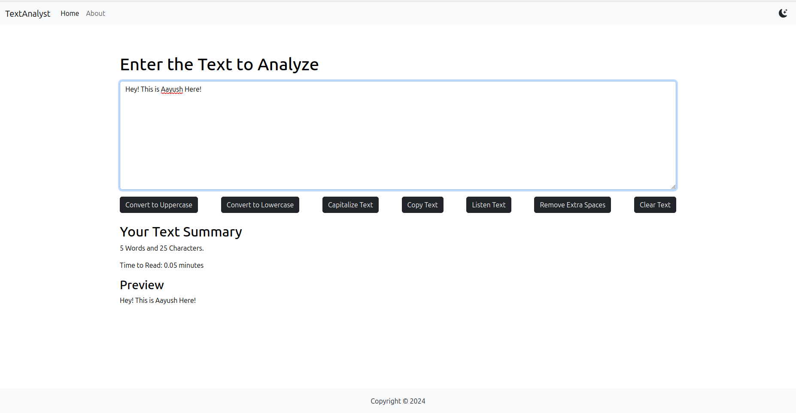
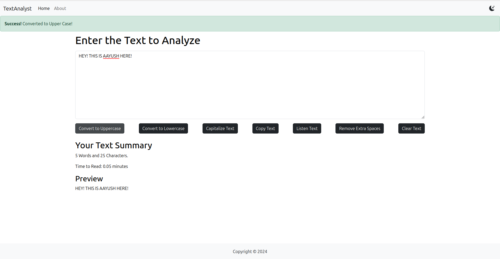
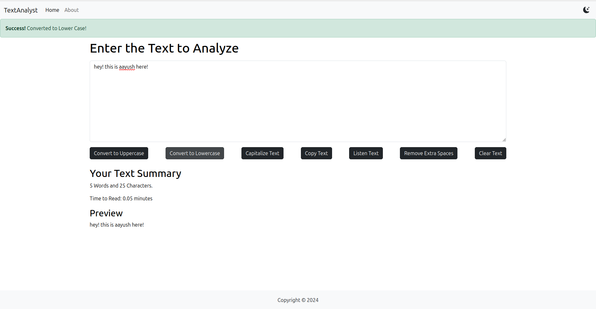
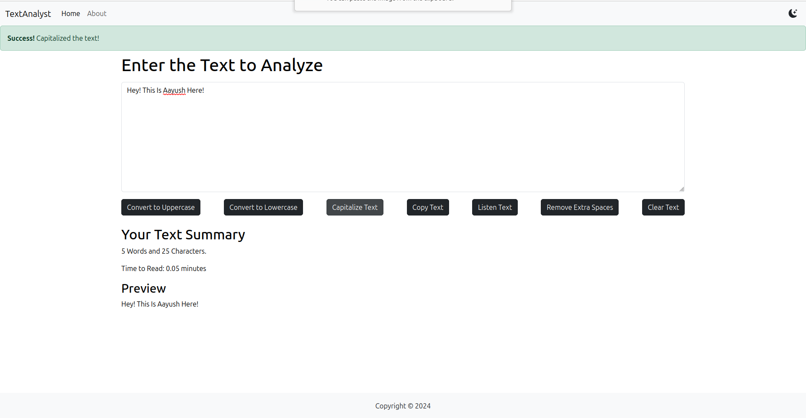
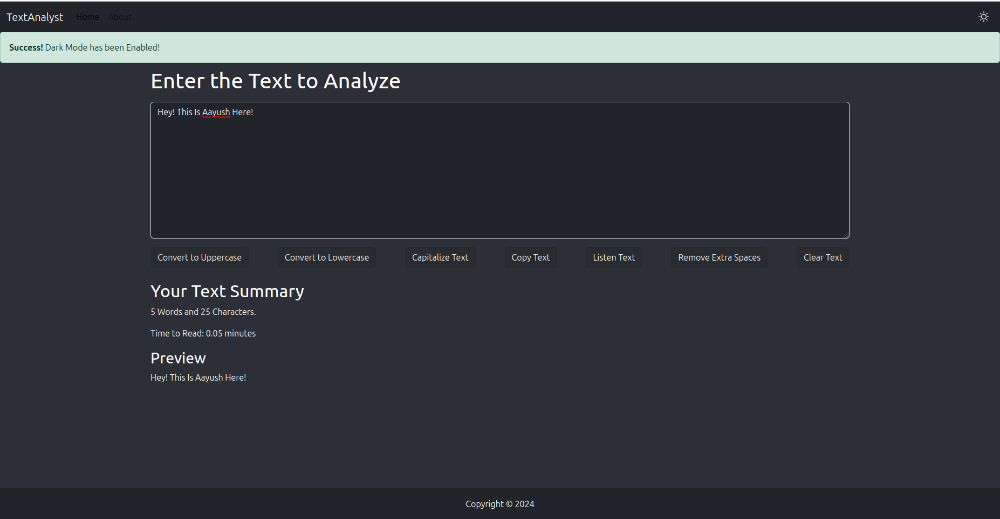
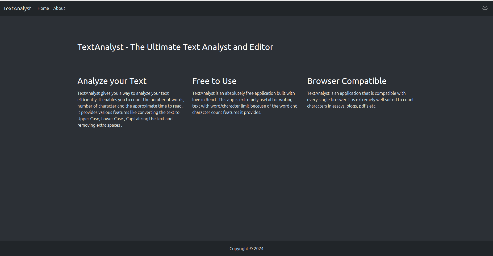

# Text-Analyst-App
The Text Analyst App is a versatile and user-friendly application developed using React, designed to enhance your writing and text manipulation experience.

# Features

- **Word and Character Count**: Instantly see the number of words and characters in your text to keep track of your content length.
- **Text Preview**: View a real-time preview of your text to see how it looks before finalizing.
- **Text Transformation**: Easily convert text to uppercase, lowercase, or capitalize each word with a single click.
- **Text-to-Speech**: Listen to your text being read aloud to catch errors and improve your content.
- **Remove Extra Spaces**: Clean up your text by removing unnecessary spaces and formatting issues.
- **Light and Dark Mode**: Switch between light and dark modes to suit your reading and writing preferences.

# Screenshots

### Preview Text

### Convert To UpperCase

### Convert To LowerCase

### Capitalize The Text

### Enable Dark Mode

### About Page

